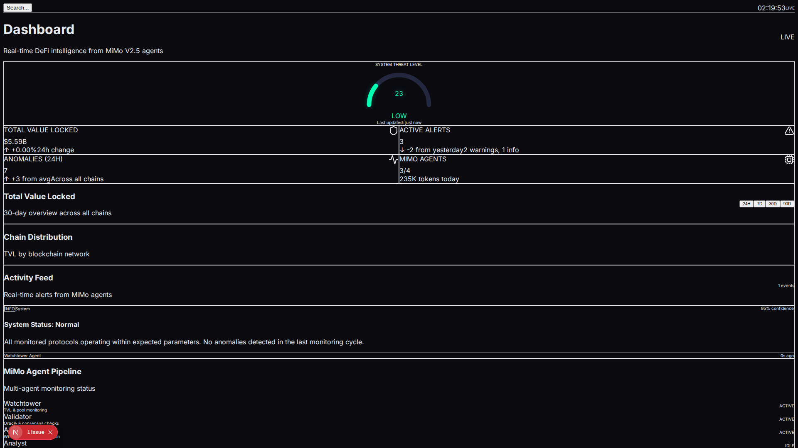
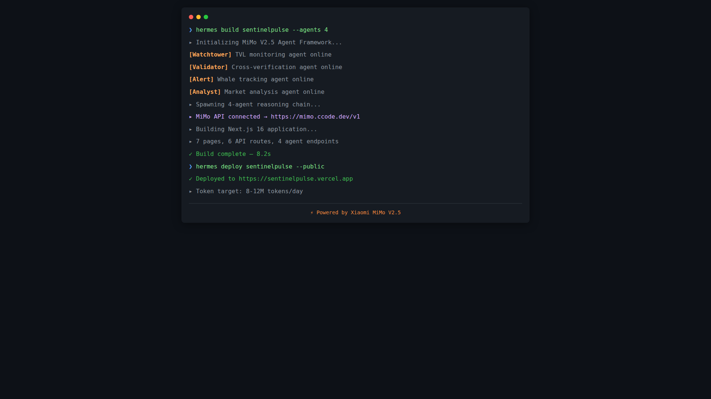

# SentinelPulse

> **Powered by Xiaomi MiMo V2.5** — DeFi Protocol Monitor

Real-time DeFi protocol monitoring platform. Track TVL, detect anomalies, and monitor whale movements across 100+ protocols and 15+ chains.



## Features

- **TVL Monitoring** — Track Total Value Locked across DeFi protocols via DeFiLlama
- **Whale Watch** — Monitor large transactions with risk scoring
- **Anomaly Detection** — Statistical anomaly detection on TVL and volume data
- **Protocol Analytics** — Sortable tables with chain filtering
- **Live Price Feeds** — Token prices from CoinGecko with 15-second refresh
- **Responsive Dashboard** — Dark mission-control UI

## Tech Stack

- **Framework:** Next.js 16 (App Router)
- **Language:** TypeScript
- **Styling:** Tailwind CSS
- **Charts:** Recharts
- **State:** Zustand + React Query
- **Icons:** Lucide React

## Data Sources

| Source | Data | Refresh |
|--------|------|---------|
| [CoinGecko](https://coingecko.com) | Token prices, market caps | 15s |
| [DeFiLlama](https://defillama.com) | TVL, protocol data | 30s |

## Screenshots




## Getting Started

```bash
git clone https://github.com/ferah1223/sentinelpulse.git
cd sentinelpulse
npm install
npm run dev
```

Open [http://localhost:3000](http://localhost:3000) to see the dashboard.

---

**Powered by Xiaomi MiMo V2.5**
